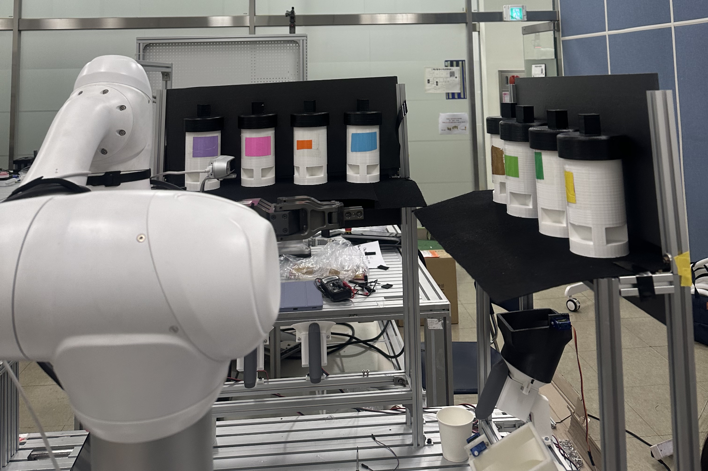
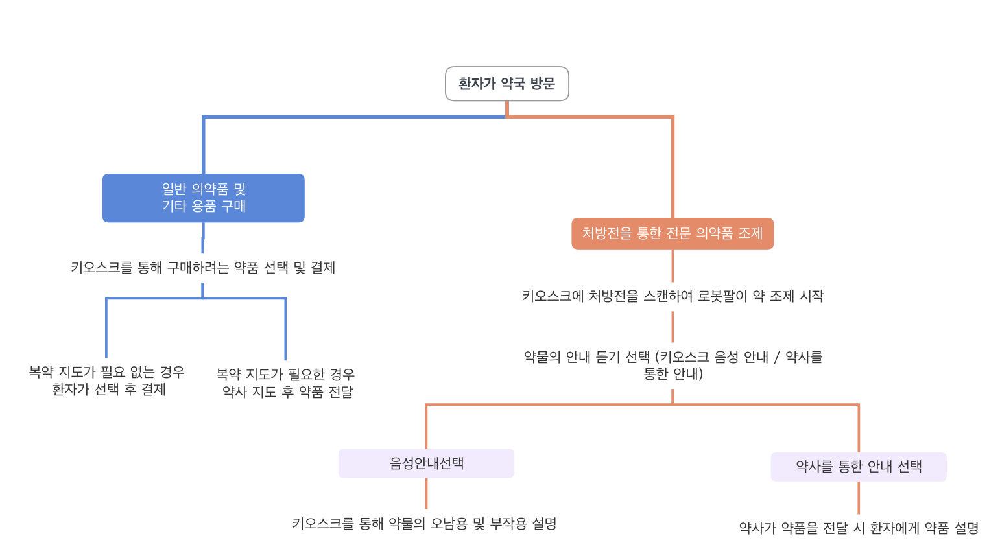
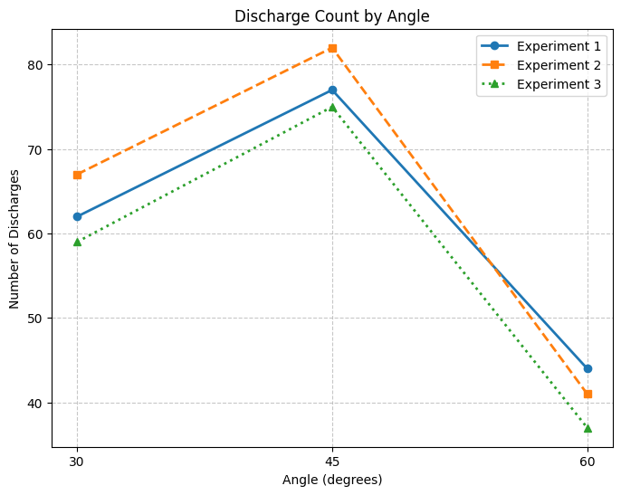
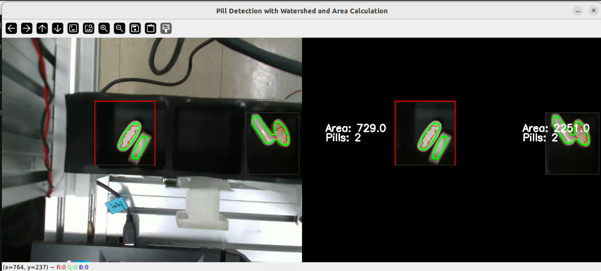
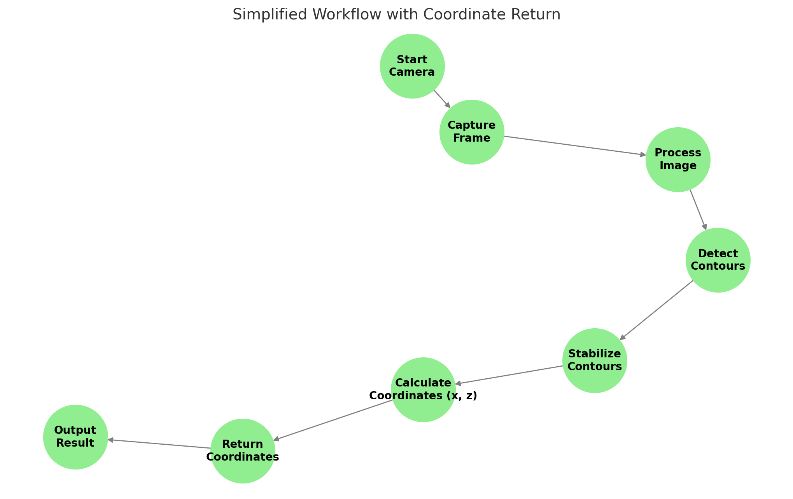
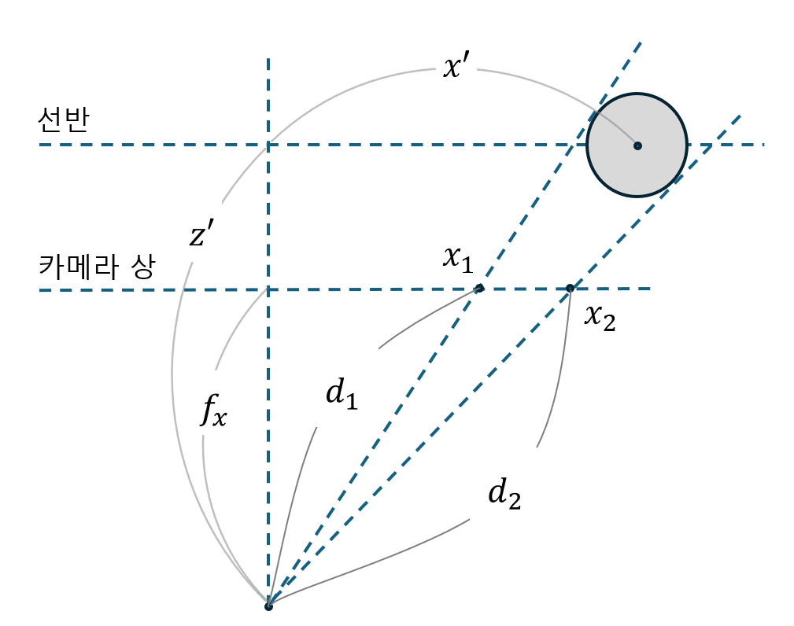
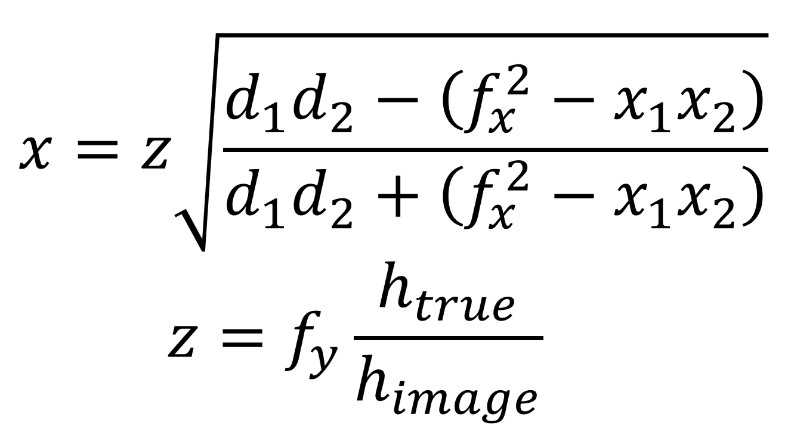
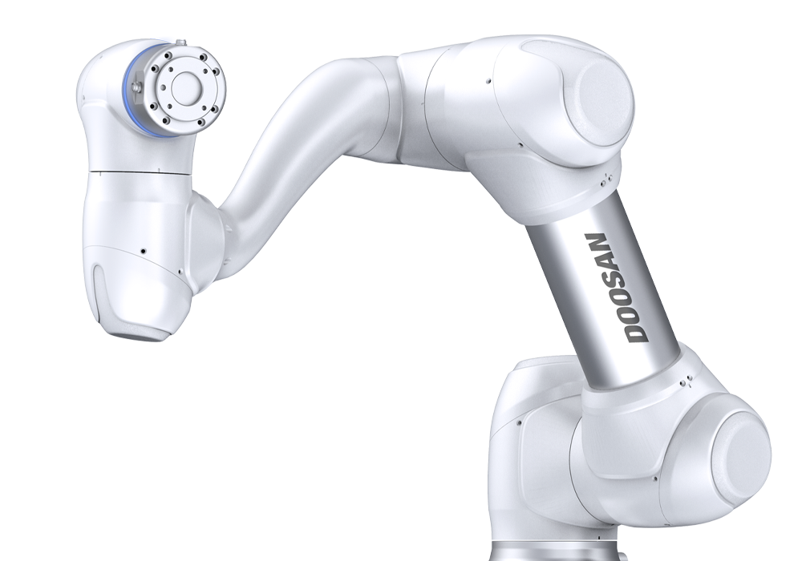

# Vision-Based Robotic Pill Dispensing System

**Design and Prototyping of a Vision-Based Robotic Pill Dispensing System**

> Presented at KSMTE 2024 Fall Conference (Jeju, Korea)

현행 알약 조제 기계(오토팩)는 약사가 직접 약을 보충해야 하며, 고위험군 약물을 장기간 취급하면 약사의 건강에 부정적 영향을 줄 수 있습니다. 본 프로젝트는 **비전 기반 매니퓰레이터를 활용한 자동 조제 시스템**을 구현하여, 알약의 토출 - 검수 - 보충 과정을 자동화합니다.

## System Overview



```
                          ┌─────────────┐
                          │   Kiosk UI  │  처방전 입력 / 일반의약품 구매
                          └──────┬──────┘
                                 │ TCP Socket
                          ┌──────▼──────┐
                          │     PC      │  미들웨어 (roboworld_ws)
                          │  Middleware  │  데이터 파싱, 비전 처리, 통신 중계
                          └──────┬──────┘
                                 │ TCP Socket
                          ┌──────▼──────┐
                          │   Doosan    │  DART Studio 프로그램
                          │ Controller  │  로봇 모션 제어
                          └──────┬──────┘
                                 │
                          ┌──────▼──────┐
                          │  M0609 Arm  │  매니퓰레이터
                          │ + RealSense │  카메라 2대 장착
                          └─────────────┘
```



## Subsystems

### 1. Dispensing Station (토출대)

스텝 모터 기반의 다중 실린더 토출기. 알약을 하나씩 개별 배출하며, 포토 인터럽터 센서로 토출 여부와 잔여 알약 수를 실시간 모니터링합니다. 토출 원판에 최적 기울기를 부여하여 알약 끼임을 방지합니다.




### 2. Inspection Station (검수대)

검수 전용 스쿱 위의 알약을 RealSense 카메라로 촬영한 뒤:

1. Otsu 이진화로 알약/배경 분리
2. 형태학적 연산 (침식 + 팽창)으로 노이즈 제거
3. Watershed 알고리즘으로 인접 알약 분리
4. 윤곽선 면적 계산으로 알약 개수 판정

처방전 데이터와 비교하여 일치하면 포장, 불일치 시 재조제합니다.



### 3. Replenishment Station (보충대)

토출기 내 알약이 부족할 때 자동으로 약통을 찾아 보충합니다:

1. 약통별 고유 색상을 HSV 컬러 범위로 모델링
2. 엔드이펙터 카메라로 Canny 엣지 + HSV 마스킹으로 약통 검출
3. 윤곽선 안정화 (1초 이상 좌표 변화 < 3px)로 떨림 방지
4. 카메라 내부 파라미터(fx, fy)를 이용해 이미지 좌표 → 실세계 x, z 거리 변환
5. 매니퓰레이터가 약통을 집어 뚜껑 개봉 후 보충





## Project Structure

```
.
├── config.example.py           # 네트워크/카메라 설정 템플릿
├── requirements.txt
│
├── DART/dart_studio/           # Doosan DART Studio 로봇 프로그램
│   ├── essential.txt
│   ├── main.txt
│   └── process1~3.txt
│
├── roboworld_ws/src/
│   ├── main.py                 # 메인 미들웨어: 키오스크 ↔ 컨트롤러 중계
│   ├── data_parser.py          # 키오스크 데이터 파싱
│   └── vision_ws/
│       ├── color_detector.py   # HSV 기반 약통 색상 검출 + 좌표 계산
│       ├── autopack.py         # 검수대 알약 개수 판정 (Watershed)
│       ├── color_dict.py       # 색상 범위 딕셔너리
│       ├── distance_calculator.py
│       └── tools/              # 개발/테스트 유틸리티
│
└── socket_ws/
    ├── main.py                 # 소켓 서버 엔트리포인트
    ├── drug_checker.py         # RealSense 기반 알약 라벨링
    ├── socket_client.py
    └── socket_server.py
```

## Hardware



| Component | Specification |
|-----------|--------------|
| Manipulator | Doosan Robotics M0609 (6-axis collaborative robot) |
| Camera | Intel RealSense D435i x 2 (검수대 1대 + 엔드이펙터 1대) |
| Dispenser | 커스텀 설계 (스텝 모터 + 다중 실린더 + 포토 인터럽터) |
| Controller PC | Python 3, TCP 소켓 통신 |

## Getting Started

### 1. Install dependencies

```bash
pip install -r requirements.txt
```

### 2. Configure

```bash
cp config.example.py config.py
```

`config.py`에서 실제 환경의 IP, 포트, 카메라 시리얼 번호를 설정합니다:

```python
KIOSK_IP        = "192.168.137.56"
CONTROLLER_IP   = "192.168.137.104"
CAMERA_SERIAL_1 = "050222071658"   # 검수기
CAMERA_SERIAL_2 = "239122074590"   # 엔드이펙터
```

### 3. Run

```bash
cd roboworld_ws/src
python main.py
```

## Communication Protocol

PC 미들웨어(`main.py`)는 키오스크와 Doosan 컨트롤러 사이에서 TCP 소켓으로 데이터를 중계합니다.

**Controller response codes:**

| Code | Action |
|------|--------|
| 1~8 | 해당 번호의 디스펜서가 비어 있음 → 비전으로 약통 탐색 후 x, z 좌표 전송 |
| 9 | 검수 요청 → 알약 개수 판정 결과 전송 |
| 0 | 작업 완료 → 다음 처방 대기 |

## Acknowledgments

This work was supported by the Ministry of Education and the National Research Foundation of Korea (NRF) under the Advanced Field Innovation Convergence University Project.
